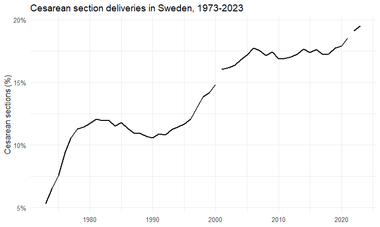
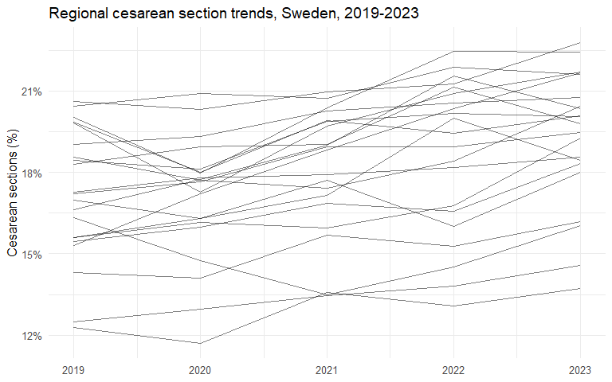
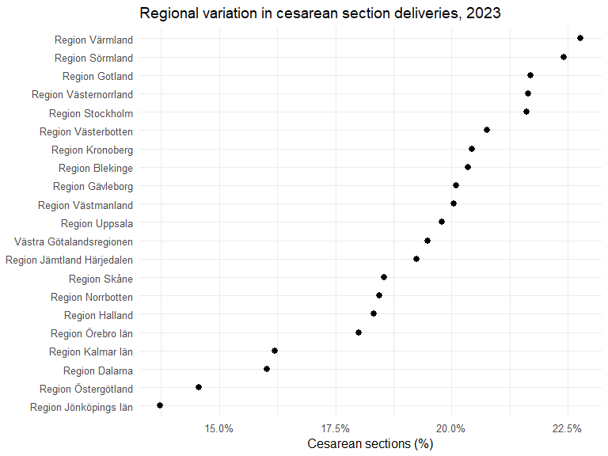
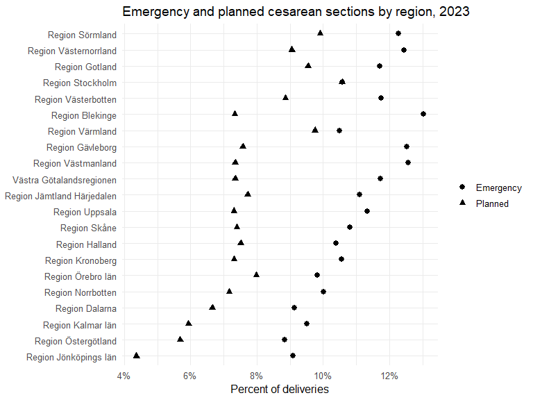

Regional variation and time trends in cesarean section deliveries in
Sweden
================

- [Background](#background)
- [Research question](#research-question)
- [Data](#data)
- [Methods](#methods)
- [Results](#results)
  - [National trend](#national-trend)
  - [Regional trends, 2019-2023](#regional-trends-2019-2023)
  - [Ranked regional variation in
    2023](#ranked-regional-variation-in-2023)
  - [Emergency vs planned cesarean sections in
    2023](#emergency-vs-planned-cesarean-sections-in-2023)
- [Interpretation](#interpretation)
- [Limitations](#limitations)

``` r
library(readr)
library(dplyr)
library(tidyr)
library(ggplot2)
library(scales)
theme_set(theme_minimal(base_size = 12))
```

# Background

This report uses publicly available official statistics from
Socialstyrelsen to describe long-term national trends and short-term
regional variation in cesarean section deliveries in Sweden.

# Research question

How have cesarean section rates changed over time in Sweden, and how
much do they vary across regions?

# Data

``` r
national <- read_csv("../data_clean/national_csection_trend_1973_2023.csv", show_col_types = FALSE)
regional_trend <- read_csv("../data_clean/regional_csection_2019_2023.csv", show_col_types = FALSE)
regional_detail <- read_csv("../data_clean/regional_csection_detail_2023.csv", show_col_types = FALSE)
```

# Methods

This is a descriptive epidemiology project. The main outcome is the
proportion of deliveries conducted by cesarean section.

# Results

## National trend

``` r
ggplot(national, aes(year, csection_total_pct)) +
  geom_line(linewidth = 0.9) +
  scale_y_continuous(labels = label_number(suffix = "%")) +
  labs(title = "Cesarean section deliveries in Sweden, 1973-2023", x = NULL, y = "Cesarean sections (%)")
```

    ## Warning: Removed 1 row containing missing values or values outside the scale range
    ## (`geom_line()`).

<!-- -->

## Regional trends, 2019-2023

``` r
ggplot(regional_trend, aes(year, csection_total_pct, group = region)) +
  geom_line(alpha = 0.5) +
  scale_x_continuous(breaks = 2019:2023) +
  scale_y_continuous(labels = label_number(suffix = "%")) +
  labs(title = "Regional cesarean section trends, Sweden, 2019-2023", x = NULL, y = "Cesarean sections (%)")
```

<!-- -->

## Ranked regional variation in 2023

``` r
regional_detail %>%
  arrange(csection_total_pct) %>%
  mutate(region = factor(region, levels = region)) %>%
  ggplot(aes(csection_total_pct, region)) +
  geom_point(size = 2.5) +
  scale_x_continuous(labels = label_number(suffix = "%")) +
  labs(title = "Regional variation in cesarean section deliveries, 2023", x = "Cesarean sections (%)", y = NULL)
```

<!-- -->

## Emergency vs planned cesarean sections in 2023

``` r
regional_detail %>%
  select(region, csection_emergency_pct, csection_planned_pct) %>%
  pivot_longer(cols = c(csection_emergency_pct, csection_planned_pct), names_to = "type", values_to = "pct") %>%
  mutate(type = recode(type, csection_emergency_pct = "Emergency", csection_planned_pct = "Planned")) %>%
  ggplot(aes(pct, reorder(region, pct), shape = type)) +
  geom_point(size = 2.4) +
  scale_x_continuous(labels = label_number(suffix = "%")) +
  labs(title = "Emergency and planned cesarean sections by region, 2023", x = "Percent of deliveries", y = NULL, shape = NULL)
```

<!-- -->

# Interpretation

This repository is meant as a descriptive epidemiology portfolio project
using official Swedish birth statistics.

# Limitations

- Public tables do not allow individual-level confounder adjustment.
- Some regional data in 2023 have missingness noted by Socialstyrelsen.
- The analysis is descriptive and should not be interpreted causally.
